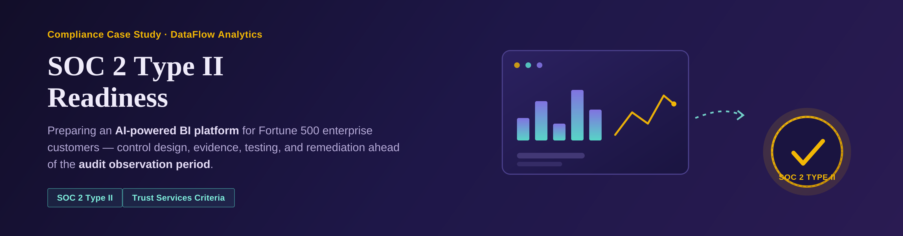

# DataFlow Analytics — SOC 2 Type II Readiness

  

## Project Brief

> DataFlow Analytics provides AI-powered business intelligence to Fortune 500 clients. Their enterprise customers now require SOC 2 Type II attestation as a contractual obligation. As Compliance Manager, document controls against Trust Services Criteria and prepare for the audit observation period.

| | |
|---|---|
| **Client** | DataFlow Analytics |
| **Sector** | AI-powered Business Intelligence (B2B SaaS) |
| **Customer base** | Fortune 500 enterprise clients |
| **Role** | Compliance Manager |
| **Objective** | Document controls against SOC 2 Trust Services Criteria and prepare for the audit observation period |
| **Driver** | SOC 2 Type II attestation as a contractual obligation for enterprise customers |

## About this repository

This repo is a structured, portfolio-style write-up of SOC 2 Type II readiness work: a realistic (fictional) case study walking through control design, evidence collection, control testing, findings, and remediation tracking — the actual sequence a Compliance Manager runs through before an auditor ever shows up.

## What's inside

| Page | Contents |
|---|---|
| [🛡️ Controls](01-controls.md) | 4 controls mapped to SOC 2 Trust Services Criteria, each specific, measurable, and testable |
| [📎 Evidence](02-evidence.md) | 5 evidence artifacts collected to support control testing |
| [✅ Control Tests](03-control-tests.md) | 4 test records, each run against a defined sample, not a general check |
| [🐞 Findings](04-findings.md) | 2 findings — only the gaps testing actually surfaced |
| [📋 Tasks](05-tasks.md) | 4 remediation tasks tracking each finding to closure |

## How to read this

Each page links to the next via the navigation bar at the bottom — Controls → Evidence → Control Tests → Findings → Tasks — following the same sequence the work was actually done in: design the control, collect evidence, test it, document what the test found, and track the fix.

## Methodology at a glance

- **Controls:** written to be specific, measurable, and testable — a named tool and mechanism, not "implement security"
- **Testing:** every result is tied to a defined sample (e.g. 14 accounts checked, 25 merges sampled, 5 simulated events) rather than a pass/fail with no basis
- **Findings:** only raised where testing found a real gap — Encryption and Change Management both passed clean and have no corresponding finding
- **Standards referenced:** SOC 2 Trust Services Criteria (e.g. `CC6.1`, `CC6.7`, `CC7.2`, `CC8.1`)

---

**[Start with Controls →](01-controls.md)**

